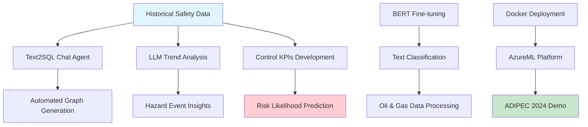
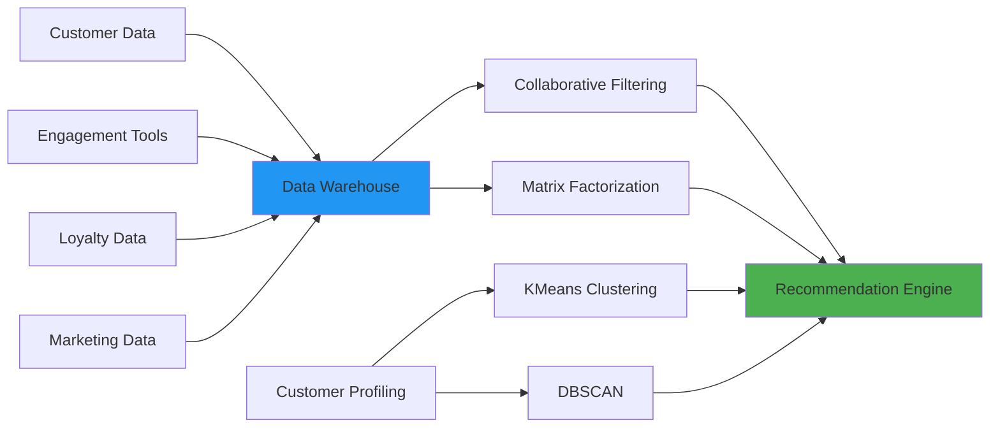
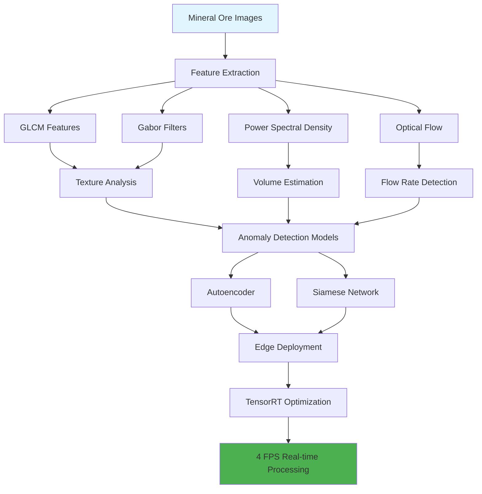
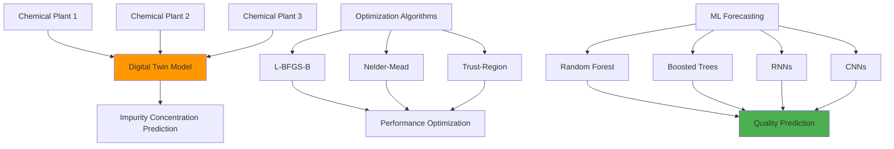
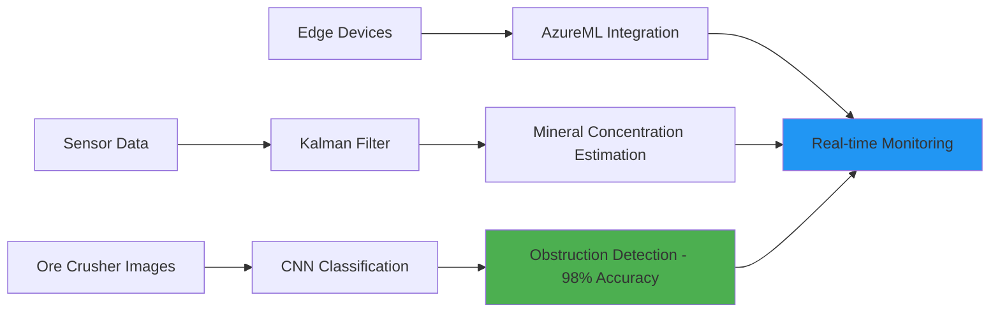
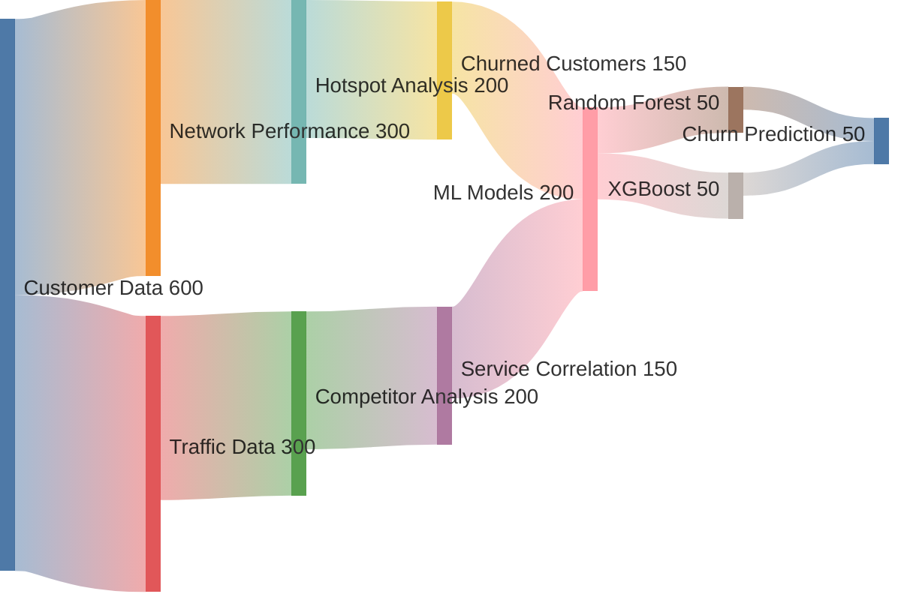
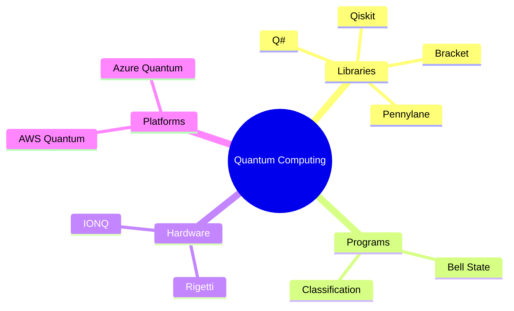
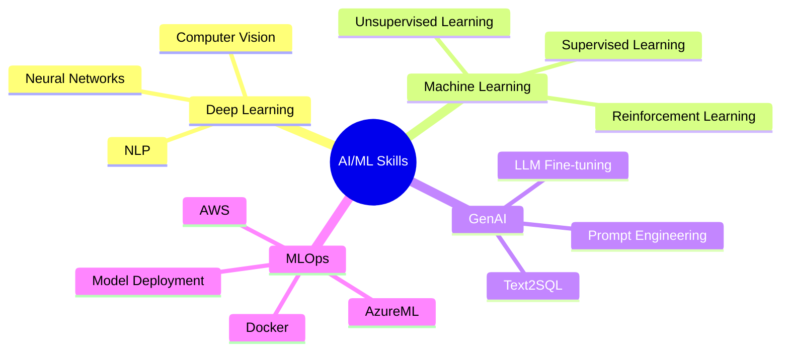
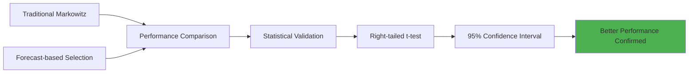
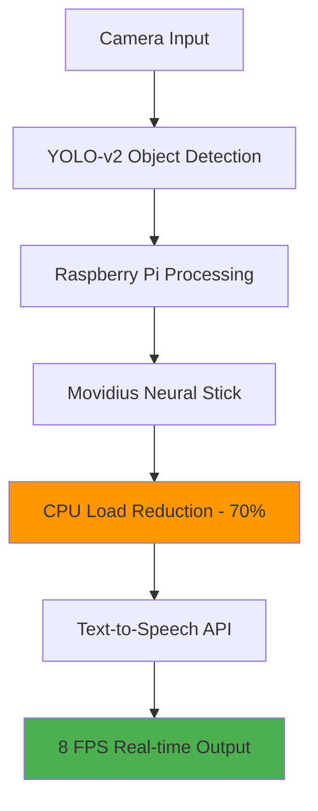

# Shantam Sharma

  

## 🚀 About Me

**Senior Data Scientist & AI Systems Graduate Student** with 5+ years of experience developing and deploying machine learning solutions across diverse industries. Passionate about bridging the gap between cutting-edge AI research and real-world applications.

- 🎓 Currently pursuing **Master's in AI Systems** at National University of Singapore
- 🏢 **5+ years** at World Wide Technology Inc. working with global clients
- 🌍 Delivered solutions across **UAE, USA, Indonesia, Netherlands, and Peru**
- 🎯 Specialized in **GenAI, Computer Vision, MLOps, and Industrial AI Applications**
- 📊 Mitigated **$10M+** in safety risks through AI-powered solutions

---

## 🎓 Education

  2016-2020   : Bachelor's of Technology, Indian Institute of Technology, Delhi
                Industrial Engineering: First Class Honours
  2025-Present : Master's of Technology, National University of Singapore
                AI Systems
---

## 💼 Professional Experience

### 🏢 Senior Data Scientist @ World Wide Technology Inc. (July 2020 - July 2025)

## 🔥 Key Projects Portfolio

### 1. 🛡️ GenAI for Asset Integrity and Process Safety
**Impact: Mitigated $10M+/year safety risks at ADNOC**

**Technologies Used:**
- 🤖 **LLMs**: GPT-4, BERT fine-tuning
- ☁️ **Cloud**: AzureML, Docker
- 📊 **Analytics**: Text2SQL, Prompt Engineering
- 🎯 **Impact**: Real-time hazard prediction system

---

### 2. 🛒 Recommendation System for Retail
**Advanced ML-powered personalized product recommendations**

**Key Achievements:**
- 📈 Integrated multiple data sources into unified warehouse
- 🎯 Advanced customer segmentation using unsupervised learning
- 🔄 Real-time personalized recommendations

---

### 3. 👁️ Computer Vision for Real-Time Inspection
**Minimized safety risks and operation downtime in mining**

**Technical Specifications:**
- ⚡ **Performance**: 4 FPS real-time processing
- 🖥️ **Deployment**: GPU-optimized edge computing
- 🔧 **Architecture**: Autoencoder + Siamese Networks
- 📱 **Platform**: TensorRT for latency optimization

---

### 4. ⚗️ Physical Modeling for Product Quality Forecast
**Increased molybdenum mineral production by 3%**

---

### 5. ⛏️ Mining Operation Optimization
**Increased production hours by 8%**

---

### 6. 📱 Churn Analytics for Telecom
**Advanced customer retention insights**

---

## 🔬 Research & Development Initiatives

### 🌌 Quantum Computing Exploration

### 🤝 Federated Learning Research
- **Methodologies**: Auto-Fed Averaging, Hyper-Networks
- **Dataset**: CIFAR-10
- **KPIs**: Generalization, Personalization, Robustness

### 🔧 AIOps Framework
- **Modular Design**: Python-based ML framework
- **Libraries**: ADTK, ARIMA
- **Integration**: Splunk, Prometheus
- **Applications**: Failure detection, Load forecasting

---

## 🛠️ Technical Skills

### Programming Languages

### AI/ML Specializations

### Cloud & Tools

---

## 🏆 Publications & Achievements

### 📚 Publications
- **"Power Usage Effectiveness (PUE) Optimization"** for Data Centers (July 2023)
- **"A Modular Approach to AIOps"** - Presented at NVIDIA GTC'22 (November 2022)

### 🎖️ Awards & Recognition
- 🏅 **Excellence Award** - WWT India for outstanding performance in mining projects (June 2022)
- 🏆 **Certificate of Merit** - CBSE for 100th percentile in Mathematics (May 2016)
- 🥇 **Top 1%** - National Standard Examination of Physics (January 2016)

---

## 🚀 Notable Projects & Internships

### 🔍 Stock Market Analysis - IIT Delhi Research

### 🏠 Business Analytics - NoBroker
- **SQL Strategy Implementation**:
  - Customer-Executive allocation optimization
  - Dynamic reallocation algorithms
  - Performance-based matching

### 👁️ MAVI - Mobility Assistant for Visually Impaired

## 🎯 Current Focus & Interests

- 🤖 **Generative AI**: Advanced LLM applications in industrial settings
- 🌐 **Edge Computing**: Optimizing AI for resource-constrained environments
- 🏭 **Industrial AI**: AI solutions for manufacturing and process industries
- 🔬 **Research**: Impact of knowledge graphs as data representation on AI solutions

---

## 📬 Let's Connect!

I'm always open to discussing new opportunities, collaborating on interesting projects, or just having a chat about AI and technology!

---

  
*"Bridging the gap between cutting-edge AI research and real-world applications"*

⭐ **Star this repository if you found it interesting!**

